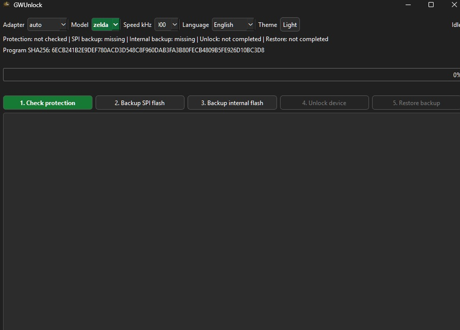

# GWUnlock



GWUnlock is a standalone Windows utility for Nintendo Game & Watch devices based on the STM32H7B0 microcontroller.

The project provides a simple graphical interface for device identification, backup, restore, and research operations using an ST-Link programmer.

## Features

* Device identification
* Protection status display
* SPI Flash backup
* SPI Flash restore
* Internal MCU Flash backup
* Internal MCU Flash restore
* ST-Link support
* Portable single-file executable
* Light and dark UI themes
* English, Russian, and Ukrainian interface languages

## Requirements

* Windows 10 x64
* Windows 11 x64
* ST-Link V2 or compatible programmer
* Installed ST-Link USB driver

No additional installation of Python, PySide6, OpenOCD, pyOCD, or gnwmanager is required. All required components are bundled into the release executable.

## Backup Files

GWUnlock stores backup files in the `backups` folder located next to the executable.

For a successful restore operation, keep the following files from the same device:

* SPI Flash Backup
* MCU Flash Backup
* ITCM Backup

It is strongly recommended to store backups in a safe location.

## Building

Install project dependencies and build using PyInstaller:

```powershell
python -m PyInstaller --noconfirm GWUnlock.spec
```

The generated executable will be placed in the `dist` directory.

## Acknowledgements

This project was inspired by the research and work of the Nintendo Game & Watch community, including:

* https://github.com/ghidraninja/game-and-watch-backup
* https://github.com/ghidraninja/game-and-watch-hacking
* https://github.com/BrianPugh/gnwmanager

Special thanks to all members of the Game & Watch modding community for their research, documentation, testing, and contributions.

## Third-Party Components

This project uses or bundles the following third-party components:

* Python
* PySide6 (Qt for Python)
* OpenOCD
* pyOCD
* gnwmanager

See `THIRD_PARTY_NOTICES.md` for additional information.

## Licenses

GWUnlock source code is released under the Unlicense.

GWUnlock release binaries bundle third-party components under their own licenses. Third-party license information is provided in `THIRD_PARTY_NOTICES.md`. Full license texts for bundled components are provided in the `licenses/` directory.

The ST-Link USB driver is not bundled with GWUnlock and must be installed separately by the user.

## Disclaimer

This project is not affiliated with, endorsed by, or associated with Nintendo, STMicroelectronics, or any other company mentioned in this repository.

GWUnlock is intended for backup, restore, research, preservation, and educational purposes only.

Users are solely responsible for any actions performed with their devices. The author assumes no responsibility for data loss, device damage, or any consequences resulting from the use of this software.
